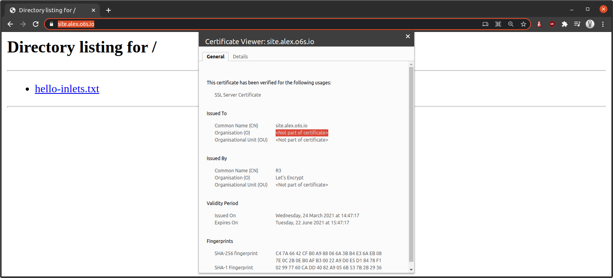

# Quick-start: Expose a local HTTP server with a Let's Encrypt certificate

The easiest way to get started is with `inletsctl` which will create a public host for us on DigitalOcean and then configure the inlets-server automatically.

## Get inletsctl and `inlets`

```bash
# Remove `sudo to install to the local folder
curl -sLSf https://raw.githubusercontent.com/inlets/inletsctl/master/get.sh | sudo sh

sudo inletsctl download --pro
```

## Start a Python HTTP fileserver

The default port is 8000. Careful where you run this command because it will serve the current working folder to the Internet.

```bash
export STORE=/tmp/store/

mkdir -p $STORE
cd $STORE
echo "Hi" > hello-inlets.txt
python -m SimpleHTTPServer 8000
```

## Create the exit-server on DigitalOcean

Now create an exit-server using inletsctl to automate the creation of the public host and the installation of the inlets server component:

```bash
inletsctl create --provider digitalocean \
  --region lon1 \
  --access-token-file ~/digitalocean-api
```

Note down the `--url` and `--token`, mine are as follows:

* `--url "wss://178.62.100.112:8123/connect"`
* `--token "4moSFBzB197ooqSoNpKsrJtEkladjJKwnCV6n42GF8EYa07HZjRXzoBbuTRIMPEU"`

## Customise the exit-server with your domain

By default inletsctl provisions servers for TCP tunnel servers. We'll log in and update it to a HTTP tunnel server. In the future, this may be integrated into inletsctl for us.

Create a DNS A record with the IP address that you received from DigitalOcean.

* `178.62.100.112` -> `web.example.com`

You'll also get an email with the root password, or you can look it up in your dashboard.

Log in over SSH:

```bash
ssh root@web.example.com
```

Update inlets PRO:

```bash
curl -sLSf https://github.com/inlets/inlets-pro/releases/download/0.8.3/inlets-pro -o inlets-pro
chmod +x inlets-pro
sudo systemctl stop inlets-pro
sudo mv inlets-pro /usr/local/bin/
```

Edit `/etc/systemd/system/inlets-pro.service`

```
[Unit]
Description=inlets PRO TCP server
After=network.target

[Service]
Type=simple
Restart=always
RestartSec=2
StartLimitInterval=0
EnvironmentFile=/etc/default/inlets-pro
ExecStart=/usr/local/bin/inlets-pro tcp server --auto-tls --auto-tls-san="${IP}" --token="${AUTHTOKEN}"

[Install]
WantedBy=multi-user.target
```

Change it so that it includes the domain name you just created. This will cause the exit-server to obtain a TLS certificate from Let's Encrypt:

```
[Unit]
Description=inlets PRO HTTP server
After=network.target

[Service]
Type=simple
Restart=always
RestartSec=2
StartLimitInterval=0
EnvironmentFile=/etc/default/inlets-pro
ExecStart=/usr/local/bin/inlets-pro http server --auto-tls --auto-tls-san="${IP}" --token="${AUTHTOKEN}" --letsencrypt-domain web.example.com --letsencrypt-email contact@o6s.io

[Install]
WantedBy=multi-user.target
```

We changed the following:

* We changed the `Description` to `inlets PRO HTTP server`
* `inlets-pro http server` changed from `tcp server` to enable HTTP tunnels
* We added `--letsencrypt-domain` and `--letsencrypt-email`

Now restart the tunnel server and check its logs:

```bash
sudo systemctl daemon-reload && \
  sudo systemctl restart inlets-pro && \
sudo journalctl -u inlets-pro -f
```

You should see that everything worked:

```bash
2021/03/24 15:47:14 Starting HTTP client. Version 0.8.3 - 205c311fde775723cf68b8116dacd7f428d243f8
2021/03/24 15:47:14 Wrote: /tmp/certs/ca.crt
2021/03/24 15:47:14 Wrote: /tmp/certs/ca.key
2021/03/24 15:47:14 Wrote: /tmp/certs/server.crt
2021/03/24 15:47:14 Wrote: /tmp/certs/server.key
2021/03/24 15:47:14 TLS: 178.62.100.112, expires in: 2491.999989 days
2021/03/24 15:47:14 Data Plane Listening on 0.0.0.0:80,443
2021/03/24 15:47:14 Control Plane Listening with TLS on 0.0.0.0:8123
2021/03/24 15:47:18 [site.example.com] Serving HTTP->HTTPS on [::]:80 and [::]:443
```

## Connect your client

Now use the token and url you received in the previous step to connect.

```bash
inlets-pro http client \
 --url "wss://178.62.100.112:8123" \
 --token "4moSFBzB197ooqSoNpKsrJtEkladjJKwnCV6n42GF8EYa07HZjRXzoBbuTRIMPEU" \
 --upstream web.example.com=http://127.0.0.1:8000
```

You can provide more than one `--upstream` if you like, but you will also need a corresponding `--letsencrypt-domain` flag.

So, the server would have:

```
--letsencrypt-domain grafana.example.com \
  --letsencrypt-domain prometheus.example.com
```

The above would provision two separate TLS certificates, they do not strictly need to be part of the same top-level domain.

And the client would have two entries for the `--upstream` value.

```
--upstream grafana.example.come=http://127.0.0.1:3000,prometheus.example.come=http://127.0.0.1:9090
```

Or you could use two separate clients, each of which provides one of the upstream endpoints.

If you need more than a few separate TLS certificates, you may want to see the note at the end of the tutorial about using your own reverse proxy and a wildcard TLS certificate instead.

## Access your public service

You can now access the Python HTTP server by going to the domain name you created earlier.



From here, you can keep your tunnel server and re-connect the same service to it, or disconnect and change the service you want to expose by changing the `--upstream` URL. You can also enter the IP address or a hostname of another computer on your network, for instance: `--upstream web.example.com=http://192.168.0.10:3000`.

Finally feel free to run `inletsctl delete` with the command given to you.

```bash
inletsctl delete --provider digitalocean --id "179755668"
```

## Wrapping up

In this tutorial we automated the cloud host using inletsctl, it provisioned a server using an API token from DigitalOcean and then we started the tunnel manually.


There are many reasons that you may want to get incoming Internet access to your services either for development, or for production use. Above is an example of a webhook receiver, where the public IP is shared with GitHub. For this example, if your local HTTP port was `3000`, you would simply alter the `--upstream` flag from `8000` to `3000`.

An alternative to having inlets PRO's HTTP functionality terminate TLS for you, is to use the TCP mode, and forward ports 80 and 443 to a local reverse proxy such as Nginx running on your client's network.
